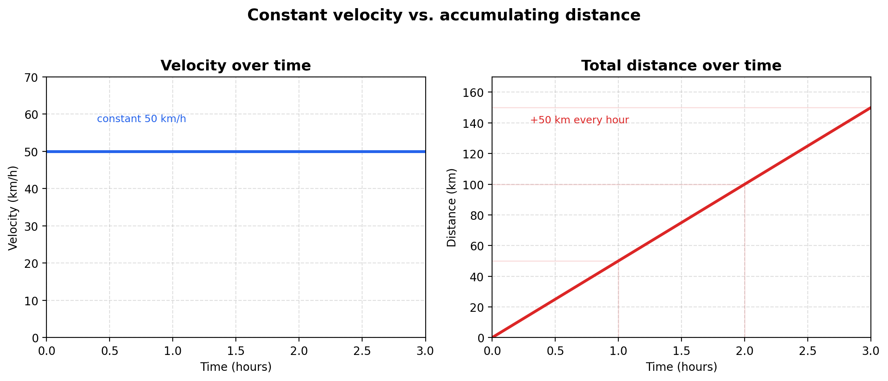
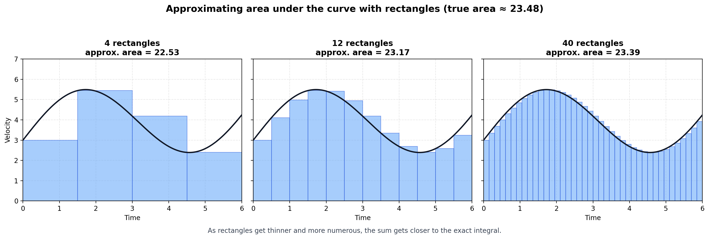

+++
date = '2026-08-21T11:03:35+01:00'
draft = false
title = 'Basic Overview of Calculus'
toc = true
+++

This post will serve as a basic introduction to my series on calculus. What will follow in this post is a top-down overview of the main Calculus concepts and their main ideas. I will attempt to use the least amount of formal mathematics in this post, but later on as we deep dive on each concept I aim to slowly introduce rigorousness while still giving you a layman's look on every theory of calculus. I will also try to keep the rigour and concepts as separate as I can, only linking them in exercises where necessary.

## Introduction

Calculus mainly deals at its core with rates of change. How quickly objects are moving and how that speed changes. The best example of calculus is the speedometer. As you add speed acceleration gets bigger, and the total distance is increasing. Calculus is all about analysing these changes. Analysing rates of change is called differentiation and analysing total distance is called integration.

Notice firstly that both velocity and total distances use different units of time. Velocity uses km/h and total distance uses kilometers, no time unit attached. This difference will prove to be crucial later on. Calculus asks the question: Can you find velocity using total distance? And vice versa?


Think of a car travelling 50 km/h. What does it mean?


|Time elapsed (h)|Total distance (km)|Velocity (km/h)|
|---|---|---|
|0.0|0|50|
|0.5|25|50|
|1.0|50|50|
|1.5|75|50|
|2.0|100|50|
|2.5|125|50|
|3.0|150|50|

Note that no matter how far you travel, the velocity stays the same. We can also calculate the average velocity from this:

$$\text{Average velocity} = \frac{\text{Change in position}}{\text{Time elapsed}}$$


If I gave you a 3-hour recording of a speedometer of a car travelling, but no odometer, would you be able to figure out how far you travelled just with this information alone? Grab pen and paper and write down the answer. Justify it. Over the course of these posts I want you to physically write down answers to these questions. This is how you cement this knowledge in your brain.


Here are two twists to this question:


How would you calculate the total distance if the velocity was always 100 km/h?



What if the velocity was constantly going up and down? How would you calculate the distance then?


With these two questions in mind, answer these too:


What does the speed tell you?



What is the total distance?



Follow-up: what if I gave you the opposite scenario? 3-hour trip, but now only with the odometer. How would you figure out the velocity then?


Velocity and total distance are two sides of the same coin. That is the crux of calculus, the theory that keeps it all together.

**Differentiation is an inverse operation to integration**.

On a graph, differentiation is an equation. Integration is the sum. But they are exact opposites.

## More on differentiation

Differentiation is the rate of change, like discussed. It's best to think of differentiation as zooming in really close on the graph. At that point, when you zoom in very closely, any curve is linear. If that flat line goes down, the derivative is negative; if it goes up, it's positive.

{{< discussion-question answer="It works here because velocity never changes, so distance divided by time lands on the same number no matter which two points you pick. For a car speeding up and slowing down, that ratio would be different for every row: dividing total distance by total time only gives you an _average_ velocity over that stretch, not the actual speed at any one instant. The table would still have distance and time columns, but the velocity column would only tell you the truth once the time intervals between rows shrunk down to almost nothing." >}}
Look at the table above. Notice that no matter which row you pick, dividing distance by time always gives you 50. Why does that work here but wouldn't work for the constantly-going-up-and-down velocity case from the earlier twist question? What would the table look like if you tried to build it for a car that's speeding up and slowing down the whole trip?


## Limits

One concept that we haven't discussed yet is limits. These play a role mostly in differentiation. To discuss this properly, I first need to introduce you to indeterminate forms. These forms do not give us any information. $\frac{0}{0}$, $\frac{\infty}{\infty}$. All of these fractions cannot be evaluated. In differentiation, derivatives will often reach these values due to the nature of rates of change; a lot of functions approach either zero or infinity. Values often end up in indeterminate forms, but they cannot be evaluated. What do we do then? This is where limits come in. Instead of reaching that very far function, we take its limit. We get very very close to the target function, but we do not evaluate the indeterminate form that occurs at $f(x)$. We evaluate it just next to that point instead: a little below it, at $x - 0.000001$, and a little above it, at $x + 0.000001$, to avoid reaching zero or infinity directly. If both sides settle on the same answer, that's the value we can now evaluate. Do note that this example is an approximation, but when we get to limits and their theorems we can prove that these are real values, not approximations. For now, take it for granted that these are actual values and not approximations.

Here's a thought exercise that will make it make sense. Take the paradox of the arrow hitting a shield. The arrow travels half the distance, then another half, then another. Supposedly to infinity. Here are two questions:


Does the arrow ever actually touch the shield?



So if the arrow never touches the shield, what's the point of asking where the arrow ends up?


Limit doesn't ask "where do you end up". It asks "Where are you headed".

## Integration

There are two types of integrals: indefinite and definite. Definite integrals simply have a numerical value: a real number that is practical and workable. Indefinite integrals can only be represented in algebra terms.

See the summation example on the graph. We're taking small slices at varying instants of time. That's purely summation. It's an approximation. It's a really close approximation, but it isn't 100% accurate. The integral part makes it exact: what if instead of chopping the graph into chunks of seconds, milliseconds, or anything at all, we could take chunks so small that there is nothing left to guess? It's not a new magical operation; it's exactly the same as summation. But integration is at a "super-nano" scale. It adds up every "right now" there ever was. The guesswork disappears!


Let's say you have a piece of land that runs along a river. It isn't straight; it's wobbly and bends. How would you calculate the area of that land?



Here's a follow-up question: is there a point where rectangles get so tiny that they accurately describe the area?


## Summary
This post explored the informal way to talk about calculus. In the next posts I will start slowly introducing rigorous mathematics, but understanding comes before rigour. Differentiation theories are up next. Each major concept will get each own blog post in order to keep them short and atomic.

See you soon! And remember, enjoy the journey, not the destination.
